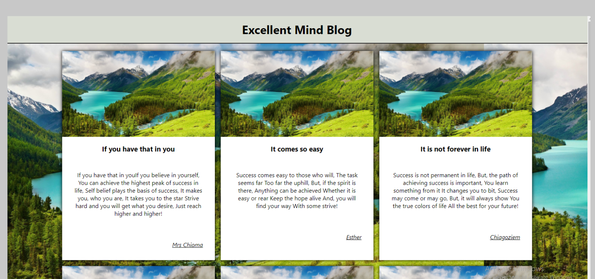

# info.json

## About The Project
This project is about fetching data from an API

## Image

## Built With
* CSS
* HTML
* Javascript

## Author
* 👨‍🦱Ezekiel Ogunniwa
    * Github: https://github.com/Eminentzeal
    * linkedin: https://www.linkedin.com/in/ogunniwaezekiel/
    * Twitter: https://twitter.com/Ogunniwaezekiel

## Facilitators
* [Godwin Nwachukwu](https://github.com/Gnwin).

* [Chioma Nwachukwu](https://github.com/Chiomy).

## Acknowledgements
* HomeFrontStartup
    * http://homefrontstartup.com.ng/
    * Mentors International
        * https://mentorsint.com/
    * https://www.facebook.com/mentorshubyola/
    * https://twitter.com/hub_mic
    * https://www.linkedin.com/company/michub/

## Live Demo
[See project live here] (https://raw.githack.com/Eminentzeal/info.json/main/index.html)

## Poem Source
http://www.wishafriend.com/poems/success-poems.php

## Image Source
'https://unsplash.it/300/200

## 🤝 Contributions
* This project is open to your comments and contributions, kindly reach the author through the above author's social media handles.